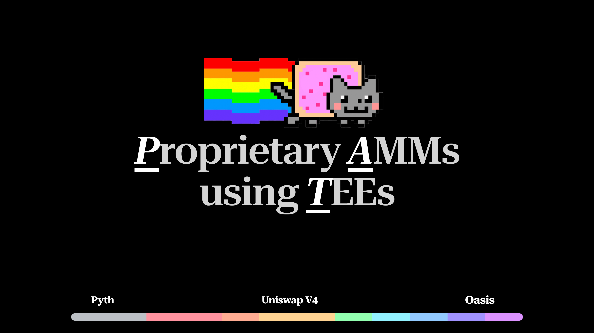
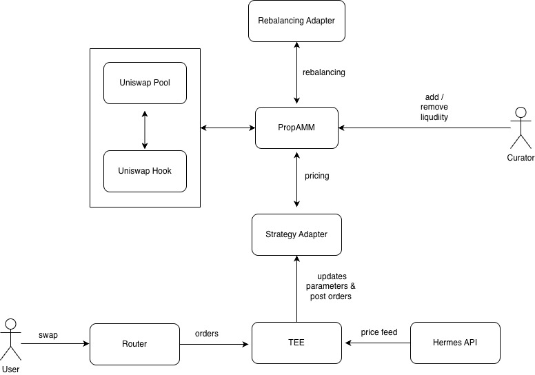

# P.A.T - Proprietary AMM Launchpad



Proprietary Automated Market Maker launchpad built on top of Uniswap V4 using Trusted Execution Environments.

## Overview

This project builds on Uniswap v4 hooks to create a proprietary (prop) AMM launchpad on Ethereum. On Solana, prop AMMs are a major venue for swaps and are especially popular with market makers, but they haven't really existed on Ethereum because of EVM limitations around gas pricing mechanisms. We address this by combining Trusted Execution Environments (TEEs) with an oracle-driven pricing mechanism, enabling complex, off-chain price computation with on-chain settlement guarantees. The result is a launchpad that lets teams deploy prop AMMs on Ethereum with market-maker-friendly features, while preserving transparency, security, and composability with the broader DeFi ecosystem.

## Architecture



Built on top of Uniswap v4 and its hook system, which serves as the execution layer for swaps. The system overrides Uniswap's default curve-based pricing with custom curve logic and introduces an asynchronous, batch-based swap model implemented via hooks. Orders are grouped into batches inside a Trusted Execution Environment (TEE) using Oasis Runtime's offchain logic, where proprietary strategies are safely executed.

### Key Components

**Contracts**
- `PropHook.sol` - Main hook contract integrating with Uniswap v4
- `PropLaunchpad.sol` - Launchpad for deploying new prop AMM pools
- `Router.sol` - Swap router that holds user funds and queues swap requests
- `SwapHandler.sol` - Utility contract for executing batched swaps

**Strategy System**
- `BaseStrategyAdapter.sol` - Base contract for strategy implementations
- `OracleStaticSpreadAdapter.sol` - Reference implementation using Pyth oracle feeds
- Custom strategy adapters can be plugged in via the adapter interface

**Threshold System**
- `BaseThresholdAdapter.sol` - Base contract for threshold implementations
- Optional component for additional swap validation logic

**Sequencer**
- TEE-based off-chain component using Oasis ROFL
- Indexes swap requests and pool launches
- Coordinates batch execution of swaps
- Manages proprietary strategy execution in secure environment

**UI**
- Next.js application for pool deployment and management
- Swap interface for executing trades
- Pool explorer for discovering active pools

## How It Works

1. **Pool Deployment**: Market makers (curators) deploy pools through the launchpad with configurable parameters including token pairs, initial liquidity, and strategy adapters.

2. **Strategy Selection**: At deployment time, curators have full control over the strategy:
   - Select the default oracle-driven strategy (Volume Weighted Adapter)
   - Deploy custom strategy contracts implementing the adapter interface

3. **Swap Execution**: Users initiate swaps through the Router contract which holds funds in escrow. The TEE sequencer batches orders and executes them using the configured strategy.

4. **Batch Processing**: For each batch, the chosen strategy updates configurable parameters (spread, skew, inventory targets) that determine execution prices. The reference implementation uses an oracle-based constant spread model powered by Pyth price feeds.

5. **Settlement**: Batch metadata and strategy parameters are encoded into hook callbacks, allowing the TEE to coordinate rich, stateful logic offchain while Uniswap only sees valid, atomic settlements onchain.

## Project Structure

```
contracts/          - Solidity smart contracts (Foundry project)
  src/
    PropHook.sol           - Main Uniswap v4 hook
    PropLaunchpad.sol      - Pool deployment launchpad
    Router.sol             - Swap router with escrow
    adapters/              - Strategy and threshold adapters
    interfaces/            - Contract interfaces
    utils/                 - Helper contracts

sequencer/          - TEE-based off-chain sequencer (ROFL)
  src/
    agents/                - Indexing agents for pools and swaps
    clients/               - Blockchain client configuration
    state/                 - State management for pools and queue

sim/                - Price simulation service
  src/
    services/              - Price simulation and parameter management

ui/                 - Next.js frontend application
  app/
    deploy/                - Pool deployment interface
    explorer/              - Pool discovery and browsing
    pool/[id]/            - Individual pool detail and swap interface
  utils/
    abi/                   - Contract ABIs
    addresses.ts           - Contract addresses
```

## Key Features

- **Flexible Strategy System**: Deploy with preset strategies or bring your own custom logic
- **Oracle Integration**: Pyth price feeds provide high-fidelity reference prices
- **Batch Execution**: TEE-based batching for efficient swap processing
- **Market Maker Friendly**: Configurable parameters for spread, skew, and inventory management
- **Transparent & Composable**: Built on Uniswap v4 for full DeFi composability
- **Secure Execution**: TEE environment ensures proprietary strategies remain private

## Contract Addresses

**Unichain Sepolia Testnet**
- PropHook: `0x6a97647586C26013C048b7EE63c47D96Fd47Ca88`
- Strategy Adapter: `0x62b12474183F9a68EDd638Cbc46f4CA6Da7ee6e6`
- PropLaunchpad: `0x2C9Be74729176439D8Bf99EFaE048ccB62a9FDEd`

## Onchain transactions

**Unichain Sepolia Testnet**
- Pool Launch: https://sepolia.uniscan.xyz/tx/0x7e71f8da6e1e0fa30b161d0d79b0650ba360c2be1fd585018743ef0127c8bb38
- Swap Request: https://sepolia.uniscan.xyz/tx/0xdfe095d6c22496b0f4a0e031c967f55452e343fd9b32d1f17202fc8028fcd1ec
- Posting Batch Orders & updating strategy parameters (TEE): https://sepolia.uniscan.xyz/tx/0xe349b5481ec840810ae58ae6b02da35bf389a6af525ac72dec886de8e55f975e 

## Development

### Prerequisites

- Node.js 18+
- pnpm
- Foundry (for contracts)

### Setup

**Contracts**
```bash
cd contracts
forge install
forge build
forge test
```

**Sequencer**
```bash
cd sequencer
pnpm install
pnpm dev
```

**UI**
```bash
cd ui
pnpm install
pnpm dev
```

**Simulator**
```bash
cd sim
pnpm install
pnpm dev
```

### Environment Variables

Create `.env.local` files in respective directories:

**ui/.env.local**
```
NEXT_PUBLIC_SEQUENCER_API_URL=<sequencer-api-url>
NEXT_PUBLIC_PROP_HOOK_ADDRESS=0x6a97647586C26013C048b7EE63c47D96Fd47Ca88
```

## Technical Details

The system encodes batch metadata and strategy parameters into hook callbacks, enabling the TEE to coordinate complex, stateful logic offchain while maintaining on-chain settlement guarantees. This architecture allows for sophisticated market making strategies without exposing proprietary logic or incurring excessive gas costs.

The hook system intercepts swap operations at key points in the Uniswap v4 lifecycle, allowing custom pricing logic to override the default constant product formula. Strategy adapters implement the pricing logic, while threshold adapters provide optional validation and risk management.

## License

MIT
